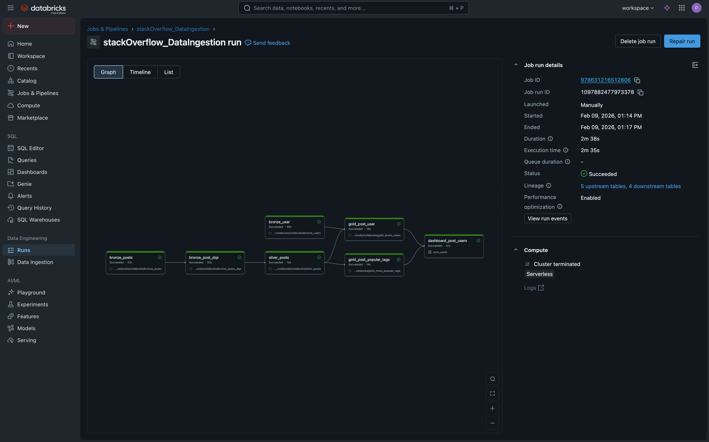
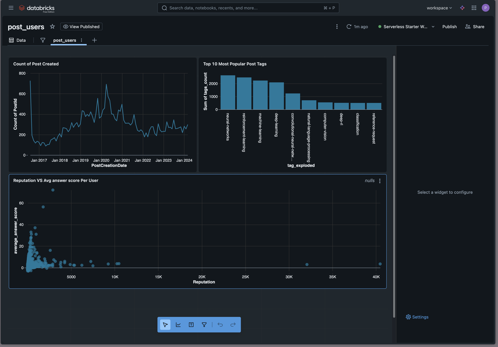
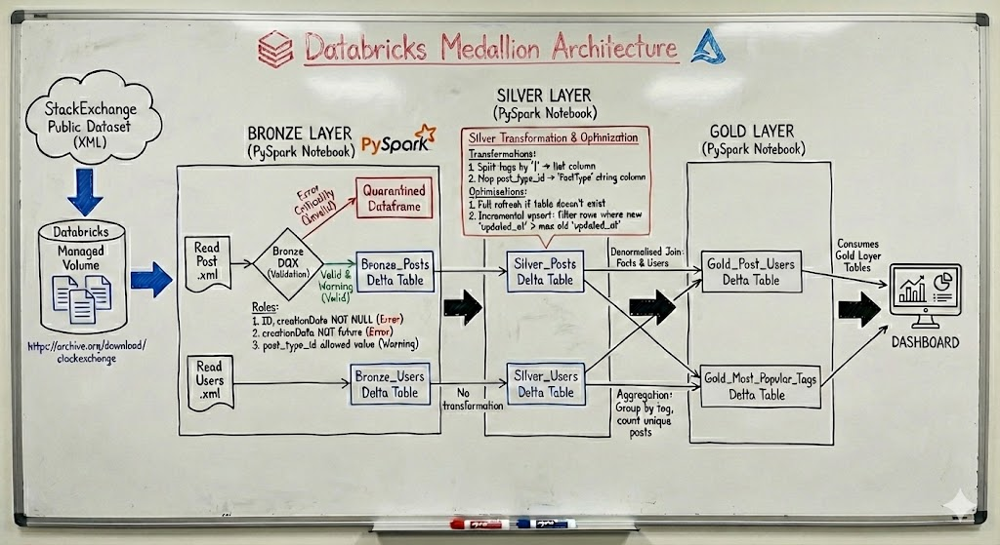

# StackExchange Medallion Architecture Project (Databricks)

## Dataset

**Link to Dataset:** [StackExchange Data Dump](https://archive.org/download/stackexchange)  

Files used:

- `Posts.xml`
- `Users.xml`

The XML files are read from a Databricks volume and processed through Bronze, Silver, and Gold layers.

## Bronze Layer

- Read `Posts.xml` and `Users.xml` from volume.  
- Declarative transformation using Spark, implemented in a Python notebook.  

### Bronze Data Quality (DQX)

Databricks built-in **Genie** feature provides a quick way to detect the correct schema struct type instead of Spark’s built-in `inferSchema`, which can be error-prone or slow.  

The following rules are applied:

#### Error Criticality Rules (quarantined if failed)

- `Id` and `CreationDate` must NOT be NULL  
- `CreationDate` must not be in the future  

Records failing these rules are considered invalid and are quarantined into a separate dataframe for manual intervention.

#### Warning Criticality Rule

- `PostTypeId` must contain allowed values  

This rule is of warning criticality, as new PostType IDs might be introduced in the source data.

## Silver Layer

Takes in raw posts and applies the following transformations:

- Split the `Tags` column by `|` and store it as a Python list in a new column `TagsArray`.  
- Map `PostTypeId` to descriptive strings in a new column `PostType`.  

### Optimisations

- Performs a **full refresh** only if the post table does not already exist.  
- Implements **incremental upsert** by filtering only rows where `updated_at` in the new table is greater than the max `updated_at` in the old table. This reduces the number of rows that need to be written.

## Gold Layer

- Create one denormalised table by joining Posts and Users tables.  
- Create another table that collects all rows with the same tag into one group and counts the number of **unique posts** per tag.  

This allows analysis of how many posts use each tag.

## Key Concepts Demonstrated

- Medallion Architecture implementation
- Declarative Spark transformations
- Built-in schema struct generation
- Data quality enforcement with quarantine pattern
- Delta Lake incremental upserts
- Gold-layer denormalisation
- Aggregation modelling for analytics
- Governance-ready design

## Governance & Reliability Features

- Data lineage via Unity Catalog
- Delta Lake versioning & time travel
- Audit logging
- Quarantine pattern for invalid records
- Incremental data processing

## Project Screenshot(s)

